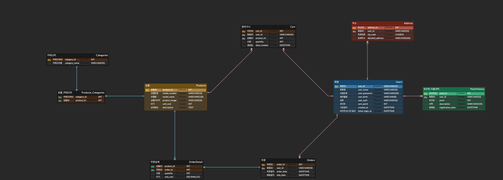

# 🛒 쇼핑몰 프로젝트

**NHN Academy**에서 배운 내용을 기반으로 Java와 Servlet/JSP를 활용하여 쇼핑몰 프로젝트를 개발하였습니다.

## 🎨 개발 환경
- **Frontend**: HTML, CSS, Bootstrap
- **Backend**: Java, Servlet/JSP, MySQL(JDBC)
- **Server**: Tomcat

### ER 다이어그램


## 🎈 개발 내용

### MVC Pattern
효율적인 개발을 위해 Servlet/JSP를 활용하여 MVC(Model, View, Controller) 패턴을 구현하였습니다.


### Custom Annotation
Java Reflection API를 활용하여 Annotation Custom을 수행하여 스프링에서 제공하는 `@RequestMapping`과 유사한 어노테이션을 구현하였습니다. 이를 통해 모든 Controller를 효율적으로 관리하였습니다.

_@RequestMapping Annotation_
```java

@Target(value = {ElementType.TYPE})
@Retention(RetentionPolicy.RUNTIME)
public @interface RequestMapping {
  enum Method{
      POST,GET
  }

  String[] value();
  Method method() default Method.GET;
}
```

Reflection API를 이용하여 모든 컨트롤러를 가져오는 코드

```java
try {
  for (Class<?> clazz : c) {
  RequestMapping annotation = clazz.getDeclaredAnnotation(RequestMapping.class);
  if (Objects.nonNull(annotation)) {
    String[] value = annotation.value();
    String method = annotation.method().name();

                    for (String url : value) {
                        String key = getKey(method, url);
                        Object instance = clazz.getDeclaredConstructor().newInstance();
                        beanMap.put(key, instance);
                    }
                }
            }
        }
```

### ThreadLocal
효율적인 JDBC Connection 관리 및 thread-safe한 환경을 구성하기 위해 ThreadLocal 변수에 Connection을 할당하는 방식을 채택하였습니다. 이를 통해 트랜잭션 문제를 최소화하고 안정적인 환경을 구축할 수 있었습니다.

```java
public class DbConnectionThreadLocal {
  private static final ThreadLocal<Connection> connectionThreadLocal = new ThreadLocal<>();
  private static final ThreadLocal<Boolean> sqlErrorThreadLocal = ThreadLocal.withInitial(() -> false);
  ...
}
```

---

## ⚔ 주요 기능

### **사용자**

1. 회원가입을 통해 아이디를 생성할 수 있습니다.


    

2. 로그인이 가능합니다.


2-1. 로그인 로직


3. 카테고리별로 상품을 조회할 수 있습니다.


4. 최근 본 상품은 쿠키를 통해 관리됩니다.


5. 상품의 상세정보를 확인하고 장바구니에 담거나 바로 구매할 수 있습니다.


    

### **회원**

1. 마이페이지에서 회원 정보를 수정하거나 탈퇴할 수 있습니다.

   

2. 상품을 장바구니에 담거나 구매할 수 있습니다.


3. 주문 내역을 확인할 수 있습니다.


  
4. 자신의 주소를 등록하고 관리할 수 있습니다.


### **관리자**

1. 카테고리를 추가/수정할 수 있습니다.


2. 상품을 추가/수정할 수 있습니다.


3. 회원 리스트를 관리할 수 있습니다.


