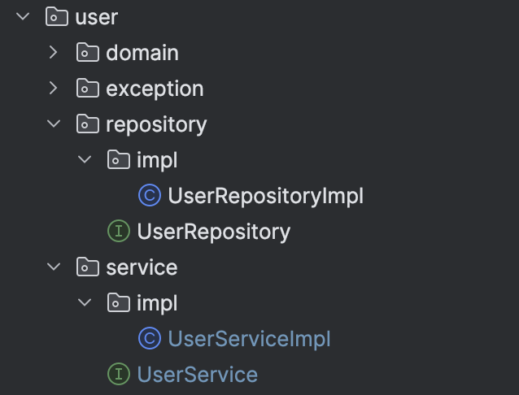
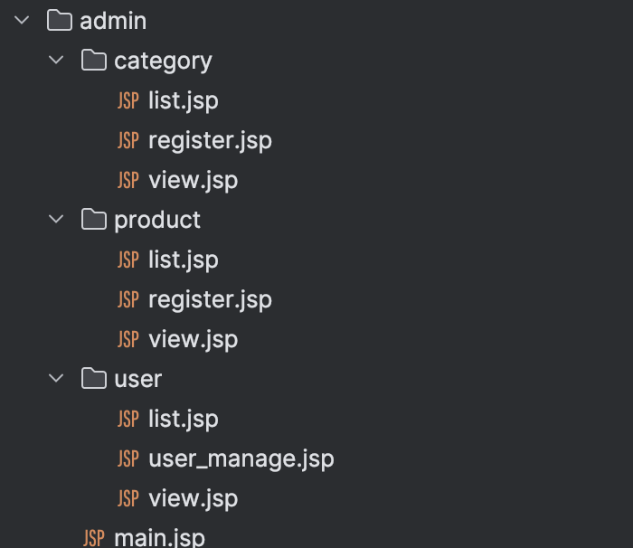
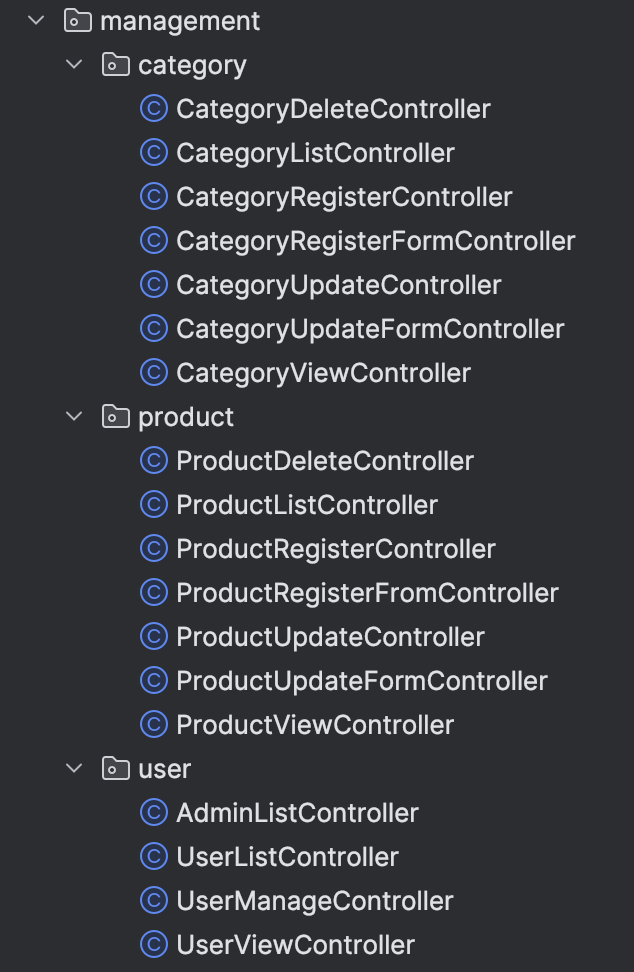

# 쇼핑몰 프로젝트

> NHN Academy에서 학습한 내용을 바탕으로 Java, Servlet/JSP을 사용하여 쇼핑몰 프로젝트를 진행하였습니다.

## 개발 환경
- Frontend : HTML, CSS, Bootstrap
- Backend : Java, Servlet/JSP, MySQL(JDBC)
- Server : Tomcat

## 개발 내용

### MVC Pattern
- Servlet/JSP를 사용하여 MVC(Model, View, Controller) 패턴으로 개발하였습니다.

  - **Model**
  
  
  - **View**
  
  
  - **Controller**
  


### Custom Annotation
- Java Reflection API를 사용하여 Annotation Custom을 하여 스프링에서 제공하는 `@RequestMapping`이라는 어노테이션을 만들었습니다.
- 해당 어노테이션을 사용하여 모든 Controller를 관리

  - RequestMapping Annotation
  ```java
  @Target(value = {ElementType.TYPE})
  @Retention(RetentionPolicy.RUNTIME)
  public @interface RequestMapping {
    enum Method{
        POST,GET
    }

    String[] value();
    Method method() default Method.GET;
  }
  ```
  - Reflection API를 사용하여 @RequestMapping 어노테이션을 사용하는 모든 컨트롤러를 가져오는 코드
  ```java
  try {
    for (Class<?> clazz : c) {
    RequestMapping annotation = clazz.getDeclaredAnnotation(RequestMapping.class);
    if (Objects.nonNull(annotation)) {
    String[] value = annotation.value();
      String method = annotation.method().name();
  
                      for (String url : value) {
                          String key = getKey(method, url);
                          Object instance = clazz.getDeclaredConstructor().newInstance();
                          beanMap.put(key, instance);
                      }
                  }
              }
          }
  ```


### ThreadLocal
- JDBC Connection을 효과적으로 관리하고 thread-safe한 환경을 구성하기 위해 ThreadLocal 변수에 Connection을 할당하는 방식 사용
  - 트랜잭션 문제를 최소화하려고 해당 방식을 사용

```java
public class DbConnectionThreadLocal {
    private static final ThreadLocal<Connection> connectionThreadLocal = new ThreadLocal<>();
    private static final ThreadLocal<Boolean> sqlErrorThreadLocal = ThreadLocal.withInitial(() -> false);
    ...
}

```

## ER 다이어그램


